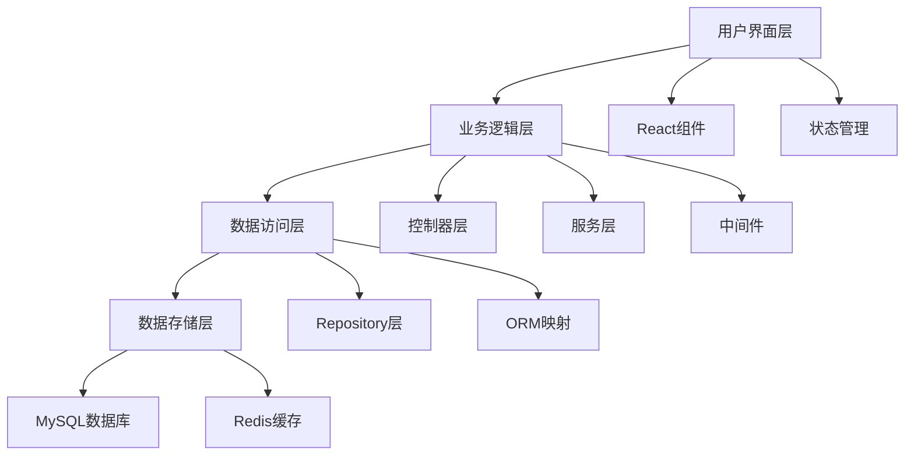

# 📚 通用开发规范指南 - 补充篇

> 文档规范、团队协作规范、质量保证与持续改进

## 📋 目录

1. [文档规范](#文档规范)
2. [团队协作规范](#团队协作规范)
3. [代码质量保证](#代码质量保证)
4. [项目管理规范](#项目管理规范)
5. [持续集成/持续部署](#持续集成持续部署)
6. [监控与运维规范](#监控与运维规范)
7. [应急响应规范](#应急响应规范)
8. [技能培训与成长](#技能培训与成长)

---

## 📖 文档规范

### README 文档规范

#### 1. 项目 README 模板
```markdown
# 项目名称

> 项目简短描述

## 📋 项目介绍

详细的项目功能介绍和核心特性。

## 🚀 快速开始

### 环境要求
- Node.js >= 16.0.0
- npm >= 8.0.0
- MySQL >= 8.0 或 SQLite

### 安装步骤
```bash
# 1. 克隆项目
git clone https://github.com/username/project-name.git
cd project-name

# 2. 安装依赖
npm install

# 3. 配置环境变量
cp .env.example .env
# 编辑 .env 文件，填写实际配置

# 4. 初始化数据库
npm run db:migrate
npm run db:seed

# 5. 启动开发服务器
npm run dev
```

## 📁 项目结构
```
project/
├── client/          # 前端应用
├── server/          # 后端API
├── shared/          # 共享代码
├── docs/           # 项目文档
└── tests/          # 测试文件
```

## 🔧 开发指南

### 本地开发
```bash
npm run dev          # 启动开发环境
npm run test         # 运行测试
npm run lint         # 代码检查
```

### 部署
```bash
npm run build        # 构建生产版本
npm run deploy       # 部署到生产环境
```

## 📚 文档链接

- [API 文档](./docs/api.md)
- [开发指南](./docs/development.md)
- [部署指南](./docs/deployment.md)

## 🤝 贡献指南

请查看 [CONTRIBUTING.md](./CONTRIBUTING.md) 了解如何参与项目贡献。

## 📄 许可证

MIT License - 查看 [LICENSE](./LICENSE) 文件了解详情。

## 📞 联系方式

- 项目负责人：[负责人姓名](mailto:email@example.com)
- 技术支持：[支持邮箱](mailto:support@example.com)
- 问题反馈：[GitHub Issues](https://github.com/username/project-name/issues)
```

#### 2. API 文档规范
```markdown
# API 文档

## 基础信息

- **Base URL**: `https://api.example.com/v1`
- **认证方式**: Bearer Token
- **响应格式**: JSON
- **编码**: UTF-8

## 通用响应格式

### 成功响应
```json
{
  "success": true,
  "message": "操作成功",
  "data": { ... },
  "meta": {
    "timestamp": "2025-01-30T12:00:00.000Z",
    "version": "1.0.0"
  }
}
```

### 错误响应
```json
{
  "success": false,
  "error": {
    "code": "ERROR_CODE",
    "message": "错误描述",
    "details": [ ... ]
  },
  "meta": {
    "timestamp": "2025-01-30T12:00:00.000Z",
    "requestId": "req_123456"
  }
}
```

## 接口列表

### 用户管理

#### 创建用户
- **URL**: `POST /users`
- **描述**: 创建新用户账户
- **权限**: 管理员

**请求参数**:
```json
{
  "name": "string (required, 2-50字符)",
  "email": "string (required, 有效邮箱格式)",
  "password": "string (required, 8-50字符，包含大小写字母、数字、特殊字符)"
}
```

**响应示例**:
```json
{
  "success": true,
  "data": {
    "id": 123,
    "name": "张三",
    "email": "zhangsan@example.com",
    "role": "user",
    "createdAt": "2025-01-30T12:00:00.000Z"
  }
}
```

**错误码说明**:
- `VALIDATION_ERROR`: 参数验证失败
- `EMAIL_EXISTS`: 邮箱已存在
- `INSUFFICIENT_PERMISSIONS`: 权限不足
```

### 技术文档规范

#### 1. 架构设计文档
```markdown
# 系统架构设计

## 1. 整体架构

### 1.1 架构图
[插入架构图]

### 1.2 技术栈
- **前端**: React 18 + TypeScript + Redux Toolkit
- **后端**: Node.js + Express + Sequelize
- **数据库**: MySQL 8.0 + Redis
- **部署**: Docker + Kubernetes + CI/CD

### 1.3 模块划分


## 2. 详细设计

### 2.1 数据库设计
[ER图和表结构说明]

### 2.2 API设计
[接口规范和数据流程]

### 2.3 安全设计
[认证授权和数据保护机制]

## 3. 部署架构

### 3.1 环境划分
- 开发环境 (Development)
- 测试环境 (Staging)
- 生产环境 (Production)

### 3.2 容器化部署
[Docker配置和Kubernetes部署方案]
```

#### 2. 开发指南文档
```markdown
# 开发指南

## 1. 开发环境搭建

### 1.1 必需软件
- Node.js 16+
- Git
- Docker
- VS Code + 推荐扩展

### 1.2 项目初始化
[详细的环境搭建步骤]

## 2. 开发流程

### 2.1 功能开发流程
1. 创建功能分支
2. 本地开发和测试
3. 提交代码审查
4. 合并主分支
5. 部署测试环境

### 2.2 代码规范
[引用通用开发规范]

## 3. 调试技巧

### 3.1 前端调试
- Chrome DevTools 使用
- React DevTools 使用
- 性能分析工具

### 3.2 后端调试
- Node.js 调试器
- 日志分析
- 数据库查询优化

## 4. 常见问题

### 4.1 环境问题
[常见环境配置问题及解决方案]

### 4.2 代码问题
[常见代码错误及最佳实践]
```

---

## 👥 团队协作规范

### 会议规范

#### 1. 每日站会 (Daily Standup)
```markdown
## 会议信息
- **时间**: 每日上午 9:30
- **时长**: 15分钟
- **参与者**: 开发团队全员
- **形式**: 线下/在线

## 会议流程
每人分享：
1. **昨天完成**: 昨天完成的主要工作
2. **今天计划**: 今天计划完成的工作
3. **遇到障碍**: 需要帮助解决的问题

## 会议原则
- 简洁明了，避免技术细节讨论
- 有问题会后单独讨论
- 准时参加，迟到需说明原因
- 记录会议要点和行动项
```

#### 2. 代码评审会议
```markdown
## 评审准备
- 提前1天发送评审材料
- 包含变更说明和测试结果
- 预估评审时间和复杂度

## 评审过程
1. **代码讲解** (5-10分钟)
   - 功能概述
   - 关键技术点
   - 潜在风险点

2. **代码审查** (15-30分钟)
   - 逐行审查关键代码
   - 讨论设计决策
   - 提出改进建议

3. **总结决策** (5分钟)
   - 明确修改要求
   - 确定再次评审时间
   - 记录评审结论

## 评审标准
- 功能正确性
- 代码质量
- 性能影响
- 安全考虑
- 可维护性
```

### 沟通协作规范

#### 1. 即时沟通工具使用规范
```markdown
## 工具选择
- **技术讨论**: Slack #tech-discussion
- **项目协调**: Slack #project-updates
- **紧急问题**: 电话 + Slack @channel
- **文档协作**: Notion/Confluence

## 沟通原则
1. **响应时间**
   - 工作时间内：30分钟内响应
   - 紧急问题：5分钟内响应
   - 非工作时间：仅处理紧急问题

2. **信息格式**
   - 问题描述要详细具体
   - 包含必要的截图/日志
   - 提及相关人员使用@功能

3. **频道使用**
   - 使用合适的频道讨论
   - 技术细节使用线程回复
   - 重要信息适当使用置顶
```

#### 2. 邮件沟通规范
```markdown
## 邮件类型和格式

### 技术问题报告
**主题**: [技术问题] 数据库连接失败 - 紧急
**内容**:
- 问题描述
- 影响范围
- 错误日志
- 尝试的解决方案
- 需要的支持

### 项目进度更新
**主题**: [项目进度] 用户管理模块 - 第2周
**内容**:
- 本周完成情况
- 下周计划
- 风险和阻碍
- 需要的资源

### 发布通知
**主题**: [发布通知] 支付系统 v2.1.0 已部署到生产环境
**内容**:
- 发布版本
- 主要功能
- 影响范围
- 注意事项
```

### 知识管理规范

#### 1. 技术文档管理
```markdown
## 文档分类
- **API文档**: Swagger/OpenAPI 自动生成
- **架构文档**: Confluence 维护
- **操作手册**: Notion 维护
- **故障排除**: Wiki 维护

## 文档生命周期
1. **创建**: 功能开发完成时创建
2. **审核**: 技术负责人审核通过
3. **发布**: 发布到团队知识库
4. **维护**: 定期更新和检查
5. **归档**: 过时文档及时归档

## 文档质量标准
- 结构清晰，易于理解
- 包含必要的示例代码
- 及时更新，保持准确性
- 使用统一的模板格式
```

#### 2. 代码知识库
```markdown
## 代码示例库
```javascript
// 常用工具函数库
const utils = {
  // 日期格式化
  formatDate: (date, format) => { ... },
  
  // 防抖函数
  debounce: (func, wait) => { ... },
  
  // API请求封装
  apiRequest: async (url, options) => { ... }
};

// 通用组件库
export const Button = ({ variant, size, children, ...props }) => { ... };
export const Modal = ({ isOpen, onClose, children }) => { ... };
```

## 最佳实践集合
- 数据库查询优化技巧
- 前端性能优化方案
- 安全编码指南
- 错误处理模式
```

---

## 🔍 代码质量保证

### 代码审查标准

#### 1. 审查清单模板
```markdown
## 功能性检查
- [ ] 功能是否符合需求规范
- [ ] 边界条件处理是否完整
- [ ] 错误场景处理是否恰当
- [ ] 用户体验是否合理

## 代码质量检查
- [ ] 代码结构是否清晰
- [ ] 命名是否恰当易懂
- [ ] 函数是否单一职责
- [ ] 是否有重复代码
- [ ] 注释是否充分

## 性能检查
- [ ] 是否存在性能瓶颈
- [ ] 数据库查询是否优化
- [ ] 缓存策略是否合理
- [ ] 内存使用是否合理

## 安全检查
- [ ] 输入验证是否充分
- [ ] 权限控制是否正确
- [ ] 敏感信息是否保护
- [ ] SQL注入防护是否到位

## 测试检查
- [ ] 单元测试覆盖率是否足够
- [ ] 集成测试是否通过
- [ ] 测试用例是否覆盖主要场景
- [ ] 测试数据是否合理
```

#### 2. 代码质量度量标准
```javascript
// 质量指标配置
const qualityMetrics = {
  // 代码覆盖率要求
  coverage: {
    statements: 80,
    branches: 75,
    functions: 80,
    lines: 80
  },
  
  // 代码复杂度限制
  complexity: {
    max: 10,          // 最大圈复杂度
    maxDepth: 4,      // 最大嵌套深度
    maxLines: 50      // 函数最大行数
  },
  
  // 代码质量评分
  maintainability: {
    min: 70,          // 最低可维护性指数
    duplication: 3    // 最大重复代码百分比
  }
};

// SonarQube 规则配置
const sonarRules = {
  // 阻断性问题
  blocker: 0,         // 不允许有阻断性问题
  critical: 0,        // 不允许有严重问题
  
  // 主要问题限制
  major: 5,           // 最多5个主要问题
  minor: 10,          // 最多10个次要问题
  
  // 技术债务
  technicalDebt: '2h' // 最多2小时技术债务
};
```

### 自动化质量检查

#### 1. 预提交检查 (Pre-commit Hooks)
```javascript
// .husky/pre-commit
#!/bin/sh
. "$(dirname "$0")/_/husky.sh"

echo "🔍 Running pre-commit checks..."

# 1. 代码格式检查
echo "📝 Checking code format..."
npm run lint:check || exit 1

# 2. 代码格式化
echo "🎨 Formatting code..."
npm run format

# 3. 运行测试
echo "🧪 Running tests..."
npm run test:changed || exit 1

# 4. 检查构建
echo "🏗️ Checking build..."
npm run build:check || exit 1

echo "✅ All checks passed!"
```

#### 2. CI/CD 质量门禁
```yaml
# .github/workflows/quality-check.yml
name: Quality Check

on: [push, pull_request]

jobs:
  quality-check:
    runs-on: ubuntu-latest
    
    steps:
      - uses: actions/checkout@v2
      
      - name: Setup Node.js
        uses: actions/setup-node@v2
        with:
          node-version: '18'
          cache: 'npm'
      
      - name: Install dependencies
        run: npm ci
      
      - name: Lint check
        run: npm run lint
      
      - name: Type check
        run: npm run type-check
      
      - name: Run tests with coverage
        run: npm run test:coverage
      
      - name: SonarQube analysis
        uses: sonarqube-quality-gate-action@master
        env:
          SONAR_TOKEN: ${{ secrets.SONAR_TOKEN }}
      
      - name: Upload coverage to Codecov
        uses: codecov/codecov-action@v1
        with:
          file: ./coverage/lcov.info
      
      - name: Security audit
        run: npm audit --production
```

---

## 📊 项目管理规范

### 项目计划与跟踪

#### 1. 项目启动流程
```markdown
## 项目立项阶段
1. **需求调研** (1-2周)
   - 用户访谈
   - 竞品分析
   - 技术调研
   - 可行性评估

2. **项目规划** (1周)
   - 功能规格说明
   - 技术架构设计
   - 开发计划制定
   - 资源配置

3. **团队组建** (1周)
   - 角色分工
   - 团队培训
   - 开发环境搭建
   - 工具选型

## 项目启动检查清单
- [ ] 项目目标明确
- [ ] 需求文档完整
- [ ] 技术方案确定
- [ ] 团队配置到位
- [ ] 开发环境就绪
- [ ] 项目管理工具配置
```

#### 2. 敏捷开发流程
```markdown
## Sprint 规划
- **Sprint 时长**: 2周
- **团队容量**: 根据团队规模确定
- **Planning 会议**: Sprint开始前1天
- **Review 会议**: Sprint结束当天
- **Retrospective**: Sprint结束后1天

## 用户故事模板
```
作为 [用户角色]
我希望 [功能描述]
以便 [价值/目标]

验收标准：
- [ ] 标准1
- [ ] 标准2
- [ ] 标准3

Definition of Done：
- [ ] 功能开发完成
- [ ] 单元测试通过
- [ ] 代码审查完成
- [ ] 文档更新完成
- [ ] 部署到测试环境
```

## 任务跟踪
- **Jira**: 任务管理和进度跟踪
- **Confluence**: 文档和知识管理
- **Slack**: 日常沟通和通知
- **GitHub**: 代码管理和PR流程
```

### 风险管理

#### 1. 风险识别和评估
```markdown
## 风险分类

### 技术风险
- 新技术学习成本
- 技术选型错误
- 性能瓶颈
- 第三方依赖问题

### 项目风险
- 需求变更频繁
- 人员流动
- 进度延期
- 质量问题

### 外部风险
- 政策法规变化
- 市场环境变化
- 竞争对手动作
- 客户需求变化

## 风险评估矩阵
| 风险 | 概率 | 影响 | 风险等级 | 应对策略 |
|------|------|------|----------|----------|
| 新技术学习成本高 | 中 | 高 | 高 | 技术预研和培训 |
| 需求变更频繁 | 高 | 中 | 高 | 敏捷开发和迭代 |
| 关键人员离职 | 低 | 高 | 中 | 知识共享和文档化 |
```

#### 2. 风险应对策略
```markdown
## 风险缓解措施

### 技术风险缓解
- **技术预研**: 新技术先做POC验证
- **技术培训**: 定期技术分享和培训
- **架构评审**: 重要技术决策集体评审
- **备选方案**: 关键技术准备备选方案

### 项目风险缓解
- **敏捷开发**: 快速迭代，及时调整
- **团队备份**: 关键角色有备份人员
- **知识共享**: 重要知识文档化
- **质量保证**: 多层次测试和代码审查

### 应急预案
- **技术故障**: 快速回滚和修复流程
- **人员紧急情况**: 工作交接和支援机制
- **进度风险**: 范围调整和资源投入
- **质量问题**: 停止发布和问题修复
```

---

## 🔄 持续集成/持续部署

### CI/CD 流水线设计

#### 1. 完整的 CI/CD 流程
```yaml
# .github/workflows/cicd.yml
name: CI/CD Pipeline

on:
  push:
    branches: [main, develop]
  pull_request:
    branches: [main]

env:
  NODE_VERSION: '18'
  REGISTRY: ghcr.io

jobs:
  # 代码质量检查
  quality-check:
    runs-on: ubuntu-latest
    steps:
      - name: Checkout code
        uses: actions/checkout@v3
        with:
          fetch-depth: 0
      
      - name: Setup Node.js
        uses: actions/setup-node@v3
        with:
          node-version: ${{ env.NODE_VERSION }}
          cache: 'npm'
      
      - name: Install dependencies
        run: npm ci
      
      - name: Run ESLint
        run: npm run lint
      
      - name: Run Prettier check
        run: npm run format:check
      
      - name: Type checking
        run: npm run type-check
      
      - name: Run tests with coverage
        run: npm run test:coverage
      
      - name: SonarCloud analysis
        uses: SonarSource/sonarcloud-github-action@master
        env:
          GITHUB_TOKEN: ${{ secrets.GITHUB_TOKEN }}
          SONAR_TOKEN: ${{ secrets.SONAR_TOKEN }}
  
  # 安全扫描
  security-scan:
    runs-on: ubuntu-latest
    steps:
      - name: Checkout code
        uses: actions/checkout@v3
      
      - name: Run security audit
        run: npm audit --production
      
      - name: Run Snyk security scan
        uses: snyk/actions/node@master
        env:
          SNYK_TOKEN: ${{ secrets.SNYK_TOKEN }}
  
  # 构建应用
  build:
    needs: [quality-check, security-scan]
    runs-on: ubuntu-latest
    outputs:
      image-tag: ${{ steps.meta.outputs.tags }}
      image-digest: ${{ steps.build.outputs.digest }}
    
    steps:
      - name: Checkout code
        uses: actions/checkout@v3
      
      - name: Setup Docker Buildx
        uses: docker/setup-buildx-action@v2
      
      - name: Login to Container Registry
        uses: docker/login-action@v2
        with:
          registry: ${{ env.REGISTRY }}
          username: ${{ github.actor }}
          password: ${{ secrets.GITHUB_TOKEN }}
      
      - name: Extract metadata
        id: meta
        uses: docker/metadata-action@v4
        with:
          images: ${{ env.REGISTRY }}/${{ github.repository }}
          tags: |
            type=ref,event=branch
            type=ref,event=pr
            type=sha,prefix={{branch}}-
      
      - name: Build and push Docker image
        id: build
        uses: docker/build-push-action@v4
        with:
          context: .
          push: true
          tags: ${{ steps.meta.outputs.tags }}
          labels: ${{ steps.meta.outputs.labels }}
          cache-from: type=gha
          cache-to: type=gha,mode=max
  
  # 部署到测试环境
  deploy-staging:
    if: github.ref == 'refs/heads/develop'
    needs: build
    runs-on: ubuntu-latest
    environment: staging
    
    steps:
      - name: Deploy to staging
        run: |
          echo "Deploying ${{ needs.build.outputs.image-tag }} to staging"
          # 实际部署逻辑
      
      - name: Run smoke tests
        run: |
          echo "Running smoke tests against staging"
          # 冒烟测试逻辑
  
  # 部署到生产环境
  deploy-production:
    if: github.ref == 'refs/heads/main'
    needs: build
    runs-on: ubuntu-latest
    environment: production
    
    steps:
      - name: Deploy to production
        run: |
          echo "Deploying ${{ needs.build.outputs.image-tag }} to production"
          # 生产部署逻辑
      
      - name: Health check
        run: |
          echo "Running health checks"
          # 健康检查逻辑
      
      - name: Notify team
        uses: 8398a7/action-slack@v3
        with:
          status: ${{ job.status }}
          channel: '#deployments'
          webhook_url: ${{ secrets.SLACK_WEBHOOK }}
```

#### 2. 部署策略

##### 蓝绿部署
```yaml
# 蓝绿部署脚本
apiVersion: argoproj.io/v1alpha1
kind: Rollout
metadata:
  name: myapp-rollout
spec:
  replicas: 5
  strategy:
    blueGreen:
      # 新版本完全启动后再切换流量
      autoPromotionEnabled: false
      scaleDownDelaySeconds: 30
      prePromotionAnalysis:
        templates:
        - templateName: success-rate
        args:
        - name: service-name
          value: myapp-svc
      activeService: myapp-active
      previewService: myapp-preview
  selector:
    matchLabels:
      app: myapp
  template:
    metadata:
      labels:
        app: myapp
    spec:
      containers:
      - name: myapp
        image: myapp:latest
        ports:
        - containerPort: 8080
```

##### 金丝雀部署
```yaml
# 金丝雀部署配置
apiVersion: argoproj.io/v1alpha1
kind: Rollout
metadata:
  name: myapp-canary
spec:
  replicas: 10
  strategy:
    canary:
      # 流量逐步切换
      steps:
      - setWeight: 10    # 10%流量到新版本
      - pause: {duration: 300s}  # 等待5分钟
      - setWeight: 30    # 30%流量到新版本
      - pause: {duration: 300s}
      - setWeight: 50    # 50%流量到新版本
      - pause: {duration: 300s}
      # 如果没有问题，自动完成部署
      
      # 分析模板
      analysis:
        templates:
        - templateName: error-rate
        - templateName: response-time
        args:
        - name: service-name
          value: myapp-svc
  selector:
    matchLabels:
      app: myapp
```

### 环境管理

#### 1. 环境配置管理
```yaml
# environments/development.yaml
apiVersion: v1
kind: ConfigMap
metadata:
  name: app-config-dev
  namespace: development
data:
  NODE_ENV: "development"
  LOG_LEVEL: "debug"
  DB_HOST: "dev-mysql.example.com"
  REDIS_URL: "redis://dev-redis.example.com:6379"
  API_RATE_LIMIT: "1000"

---
# environments/production.yaml
apiVersion: v1
kind: ConfigMap
metadata:
  name: app-config-prod
  namespace: production
data:
  NODE_ENV: "production"
  LOG_LEVEL: "info"
  DB_HOST: "prod-mysql.example.com"
  REDIS_URL: "redis://prod-redis.example.com:6379"
  API_RATE_LIMIT: "100"
```

#### 2. 秘钥管理
```yaml
# 使用 Kubernetes Secrets
apiVersion: v1
kind: Secret
metadata:
  name: app-secrets
  namespace: production
type: Opaque
data:
  DB_PASSWORD: <base64-encoded-password>
  JWT_SECRET: <base64-encoded-secret>
  ENCRYPTION_KEY: <base64-encoded-key>

---
# 在部署中引用秘钥
apiVersion: apps/v1
kind: Deployment
metadata:
  name: myapp
spec:
  template:
    spec:
      containers:
      - name: myapp
        image: myapp:latest
        envFrom:
        - configMapRef:
            name: app-config-prod
        - secretRef:
            name: app-secrets
```

---

## 📈 监控与运维规范

### 应用监控

#### 1. 指标监控体系
```javascript
// metrics/applicationMetrics.js
const prometheus = require('prom-client');

// 创建指标
const httpRequestsTotal = new prometheus.Counter({
  name: 'http_requests_total',
  help: 'Total number of HTTP requests',
  labelNames: ['method', 'route', 'status_code']
});

const httpRequestDuration = new prometheus.Histogram({
  name: 'http_request_duration_seconds',
  help: 'Duration of HTTP requests in seconds',
  labelNames: ['method', 'route'],
  buckets: [0.1, 0.5, 1, 2, 5, 10]
});

const activeConnections = new prometheus.Gauge({
  name: 'websocket_connections_active',
  help: 'Number of active WebSocket connections'
});

const databaseConnectionPool = new prometheus.Gauge({
  name: 'database_connection_pool_size',
  help: 'Size of database connection pool',
  labelNames: ['state'] // 'active', 'idle', 'waiting'
});

// 业务指标
const userRegistrations = new prometheus.Counter({
  name: 'user_registrations_total',
  help: 'Total number of user registrations'
});

const orderValue = new prometheus.Histogram({
  name: 'order_value_dollars',
  help: 'Value of orders in dollars',
  buckets: [10, 50, 100, 500, 1000, 5000]
});

// 中间件收集指标
const metricsMiddleware = (req, res, next) => {
  const start = Date.now();
  
  res.on('finish', () => {
    const duration = (Date.now() - start) / 1000;
    
    httpRequestsTotal
      .labels(req.method, req.route?.path || req.url, res.statusCode)
      .inc();
    
    httpRequestDuration
      .labels(req.method, req.route?.path || req.url)
      .observe(duration);
  });
  
  next();
};

module.exports = {
  httpRequestsTotal,
  httpRequestDuration,
  activeConnections,
  databaseConnectionPool,
  userRegistrations,
  orderValue,
  metricsMiddleware
};
```

#### 2. 日志管理
```javascript
// logging/logger.js
const winston = require('winston');
const { ElasticsearchTransport } = require('winston-elasticsearch');

// 日志格式化
const logFormat = winston.format.combine(
  winston.format.timestamp(),
  winston.format.errors({ stack: true }),
  winston.format.json(),
  winston.format.printf(({ timestamp, level, message, ...meta }) => {
    return JSON.stringify({
      '@timestamp': timestamp,
      level,
      message,
      service: 'myapp',
      environment: process.env.NODE_ENV,
      version: process.env.APP_VERSION,
      ...meta
    });
  })
);

// 创建 logger
const logger = winston.createLogger({
  level: process.env.LOG_LEVEL || 'info',
  format: logFormat,
  transports: [
    // 控制台输出
    new winston.transports.Console({
      format: winston.format.simple()
    }),
    
    // 文件输出
    new winston.transports.File({
      filename: 'logs/error.log',
      level: 'error'
    }),
    new winston.transports.File({
      filename: 'logs/combined.log'
    })
  ]
});

// 生产环境添加 Elasticsearch 传输
if (process.env.NODE_ENV === 'production') {
  logger.add(new ElasticsearchTransport({
    level: 'info',
    clientOpts: {
      node: process.env.ELASTICSEARCH_URL
    },
    index: 'myapp-logs'
  }));
}

// 日志使用示例
const logRequest = (req, res, next) => {
  logger.info('HTTP Request', {
    method: req.method,
    url: req.url,
    userAgent: req.get('User-Agent'),
    ip: req.ip,
    requestId: req.headers['x-request-id']
  });
  
  next();
};

const logError = (error, req, res, next) => {
  logger.error('Application Error', {
    error: error.message,
    stack: error.stack,
    method: req.method,
    url: req.url,
    requestId: req.headers['x-request-id']
  });
  
  next(error);
};

module.exports = { logger, logRequest, logError };
```

### 告警配置

#### 1. Prometheus 告警规则
```yaml
# alerts/application-alerts.yaml
groups:
- name: application.rules
  rules:
  # HTTP 错误率过高
  - alert: HighErrorRate
    expr: |
      (
        sum(rate(http_requests_total{status_code=~"5.."}[5m])) /
        sum(rate(http_requests_total[5m]))
      ) > 0.05
    for: 2m
    labels:
      severity: critical
    annotations:
      summary: "High error rate detected"
      description: "Error rate is {{ $value | humanizePercentage }} for the last 5 minutes"
  
  # 响应时间过长
  - alert: HighResponseTime
    expr: |
      histogram_quantile(0.95, 
        sum(rate(http_request_duration_seconds_bucket[5m])) by (le)
      ) > 2
    for: 5m
    labels:
      severity: warning
    annotations:
      summary: "High response time detected"
      description: "95th percentile response time is {{ $value }}s"
  
  # 数据库连接池耗尽
  - alert: DatabaseConnectionPoolExhausted
    expr: |
      database_connection_pool_size{state="waiting"} > 10
    for: 1m
    labels:
      severity: critical
    annotations:
      summary: "Database connection pool exhausted"
      description: "{{ $value }} connections are waiting in the pool"
  
  # 内存使用率过高
  - alert: HighMemoryUsage
    expr: |
      (process_resident_memory_bytes / 1024 / 1024) > 1024
    for: 5m
    labels:
      severity: warning
    annotations:
      summary: "High memory usage"
      description: "Memory usage is {{ $value }}MB"
```

#### 2. 告警通知配置
```yaml
# alertmanager/config.yaml
global:
  smtp_smarthost: 'smtp.gmail.com:587'
  smtp_from: 'alerts@company.com'
  slack_api_url: 'https://hooks.slack.com/services/...'

route:
  group_by: ['alertname']
  group_wait: 10s
  group_interval: 10s
  repeat_interval: 1h
  receiver: 'default'
  routes:
  - match:
      severity: critical
    receiver: 'critical-alerts'
  - match:
      severity: warning
    receiver: 'warning-alerts'

receivers:
- name: 'default'
  slack_configs:
  - channel: '#alerts'
    title: 'Alert: {{ .GroupLabels.alertname }}'
    text: '{{ range .Alerts }}{{ .Annotations.description }}{{ end }}'

- name: 'critical-alerts'
  email_configs:
  - to: 'oncall@company.com'
    subject: 'CRITICAL: {{ .GroupLabels.alertname }}'
    body: |
      {{ range .Alerts }}
      Alert: {{ .Annotations.summary }}
      Description: {{ .Annotations.description }}
      {{ end }}
  slack_configs:
  - channel: '#critical-alerts'
    title: 'CRITICAL: {{ .GroupLabels.alertname }}'
    text: '<!channel> {{ range .Alerts }}{{ .Annotations.description }}{{ end }}'

- name: 'warning-alerts'
  slack_configs:
  - channel: '#warnings'
    title: 'Warning: {{ .GroupLabels.alertname }}'
    text: '{{ range .Alerts }}{{ .Annotations.description }}{{ end }}'
```

---

## 🚨 应急响应规范

### 故障响应流程

#### 1. 故障等级定义
```markdown
## P0 - 严重故障
- **定义**: 服务完全不可用，影响所有用户
- **响应时间**: 5分钟内
- **修复目标**: 30分钟内恢复服务
- **通知范围**: 所有技术团队 + 管理层
- **示例**: 网站无法访问、数据库完全故障

## P1 - 高影响故障
- **定义**: 核心功能受影响，影响大部分用户
- **响应时间**: 15分钟内
- **修复目标**: 2小时内修复
- **通知范围**: 技术团队 + 相关负责人
- **示例**: 支付功能故障、用户无法登录

## P2 - 中等影响故障
- **定义**: 部分功能受影响，影响少部分用户
- **响应时间**: 1小时内
- **修复目标**: 8小时内修复
- **通知范围**: 相关开发团队
- **示例**: 某个功能模块异常、性能下降

## P3 - 低影响故障
- **定义**: 非关键功能问题，影响极少
- **响应时间**: 24小时内
- **修复目标**: 72小时内修复
- **通知范围**: 对应开发人员
- **示例**: UI显示问题、非核心功能异常
```

#### 2. 应急响应流程
```markdown
## 故障发现阶段 (0-5分钟)
1. **故障发现**
   - 监控告警触发
   - 用户反馈
   - 内部发现

2. **初步评估**
   - 确认故障真实性
   - 评估影响范围
   - 确定故障等级

3. **启动应急响应**
   - 通知相关人员
   - 组建应急小组
   - 开始故障记录

## 故障处理阶段 (5分钟-修复完成)
1. **问题定位** (5-20分钟)
   - 收集错误日志
   - 分析监控数据
   - 确定根本原因

2. **快速修复** (20分钟-2小时)
   - 实施临时修复
   - 验证修复效果
   - 恢复服务监控

3. **验证确认** (修复后30分钟)
   - 功能验证测试
   - 性能指标检查
   - 用户反馈收集

## 故障总结阶段 (24小时内)
1. **事后分析**
   - 根本原因分析
   - 时间线梳理
   - 影响评估

2. **改进措施**
   - 预防措施制定
   - 监控完善
   - 流程优化

3. **经验分享**
   - 团队分享会
   - 文档更新
   - 知识库完善
```

### 故障预防措施

#### 1. 系统健壮性设计
```javascript
// 熔断器模式实现
class CircuitBreaker {
  constructor(options = {}) {
    this.failureThreshold = options.failureThreshold || 5;
    this.resetTimeout = options.resetTimeout || 60000;
    this.monitoringPeriod = options.monitoringPeriod || 10000;
    
    this.state = 'CLOSED'; // CLOSED, OPEN, HALF_OPEN
    this.failureCount = 0;
    this.lastFailureTime = null;
    this.successCount = 0;
  }
  
  async call(fn, ...args) {
    if (this.state === 'OPEN') {
      if (Date.now() - this.lastFailureTime >= this.resetTimeout) {
        this.state = 'HALF_OPEN';
        this.successCount = 0;
      } else {
        throw new Error('Circuit breaker is OPEN');
      }
    }
    
    try {
      const result = await fn(...args);
      this.onSuccess();
      return result;
    } catch (error) {
      this.onFailure();
      throw error;
    }
  }
  
  onSuccess() {
    if (this.state === 'HALF_OPEN') {
      this.successCount++;
      if (this.successCount >= 3) {
        this.state = 'CLOSED';
        this.failureCount = 0;
      }
    } else {
      this.failureCount = 0;
    }
  }
  
  onFailure() {
    this.failureCount++;
    this.lastFailureTime = Date.now();
    
    if (this.failureCount >= this.failureThreshold) {
      this.state = 'OPEN';
    }
  }
}

// 重试机制
class RetryManager {
  static async withRetry(fn, options = {}) {
    const { 
      maxRetries = 3, 
      delay = 1000, 
      backoffMultiplier = 2,
      maxDelay = 10000 
    } = options;
    
    let lastError;
    
    for (let attempt = 0; attempt <= maxRetries; attempt++) {
      try {
        return await fn();
      } catch (error) {
        lastError = error;
        
        if (attempt === maxRetries) {
          break;
        }
        
        const currentDelay = Math.min(
          delay * Math.pow(backoffMultiplier, attempt),
          maxDelay
        );
        
        await new Promise(resolve => setTimeout(resolve, currentDelay));
      }
    }
    
    throw lastError;
  }
}

// 使用示例
const dbCircuitBreaker = new CircuitBreaker({
  failureThreshold: 5,
  resetTimeout: 30000
});

const getUserData = async (userId) => {
  return await dbCircuitBreaker.call(async () => {
    return await RetryManager.withRetry(
      () => database.user.findById(userId),
      { maxRetries: 3, delay: 500 }
    );
  });
};
```

#### 2. 数据备份和恢复
```bash
#!/bin/bash
# backup/backup-script.sh

# 数据库备份脚本
BACKUP_DIR="/backups/$(date +%Y%m%d)"
MYSQL_USER="backup_user"
MYSQL_PASSWORD="$MYSQL_PASSWORD"
DATABASE_NAME="production_db"

# 创建备份目录
mkdir -p $BACKUP_DIR

# 执行数据库备份
mysqldump -u $MYSQL_USER -p$MYSQL_PASSWORD \
  --single-transaction \
  --routines \
  --triggers \
  $DATABASE_NAME > $BACKUP_DIR/database_backup.sql

# 压缩备份文件
gzip $BACKUP_DIR/database_backup.sql

# 上传到云存储
aws s3 cp $BACKUP_DIR/database_backup.sql.gz \
  s3://myapp-backups/database/$(date +%Y%m%d)/

# 清理本地备份（保留7天）
find /backups -type d -mtime +7 -exec rm -rf {} \;

# 验证备份完整性
if [ $? -eq 0 ]; then
  echo "Backup completed successfully at $(date)"
else
  echo "Backup failed at $(date)" >&2
  # 发送告警通知
  curl -X POST -H 'Content-type: application/json' \
    --data '{"text":"Database backup failed"}' \
    $SLACK_WEBHOOK_URL
fi
```

---

## 🎓 技能培训与成长

### 技术培训体系

#### 1. 新员工培训计划
```markdown
## 第一周：环境和基础
- **开发环境搭建** (1天)
  - 开发工具安装和配置
  - 代码仓库权限和克隆
  - 本地环境启动

- **项目架构介绍** (2天)
  - 技术栈和架构设计
  - 代码结构和模块划分
  - 数据库设计和API设计

- **开发规范学习** (2天)
  - 代码规范和最佳实践
  - Git工作流和代码审查
  - 测试规范和质量要求

## 第二周：实践和集成
- **小功能开发** (3天)
  - 分配简单的功能需求
  - 完整的开发和测试流程
  - 代码审查和反馈

- **文档编写** (1天)
  - 学习文档规范
  - 编写技术文档
  - 更新项目文档

- **部署流程** (1天)
  - 学习CI/CD流程
  - 部署到测试环境
  - 监控和日志查看

## 第三周：团队协作
- **团队会议参与** (持续)
  - 参与每日站会
  - 参与代码评审会议
  - 参与技术分享

- **独立功能开发** (5天)
  - 分配中等复杂度功能
  - 独立完成开发和测试
  - 与团队成员协作
```

#### 2. 技术技能矩阵
```markdown
## 前端技能矩阵

| 技能领域 | 初级 (L1) | 中级 (L2) | 高级 (L3) | 专家 (L4) |
|----------|-----------|-----------|-----------|-----------|
| **HTML/CSS** | 基础标签和样式 | 响应式设计 | CSS架构和预处理器 | 性能优化和最佳实践 |
| **JavaScript** | 基础语法和DOM | ES6+和异步编程 | 设计模式和性能优化 | 引擎原理和架构设计 |
| **React** | 组件和状态管理 | Hooks和生命周期 | 性能优化和架构 | 源码理解和生态系统 |
| **工程化** | 基础构建工具 | Webpack配置 | 完整工程化方案 | 工具链设计和优化 |

## 后端技能矩阵

| 技能领域 | 初级 (L1) | 中级 (L2) | 高级 (L3) | 专家 (L4) |
|----------|-----------|-----------|-----------|-----------|
| **Node.js** | 基础API和模块 | Express和中间件 | 性能优化和架构 | 源码理解和生态 |
| **数据库** | 基础CRUD操作 | 索引和查询优化 | 数据库设计和调优 | 分布式和高可用 |
| **微服务** | 服务拆分理解 | 服务通信和治理 | 架构设计和实践 | 平台化和云原生 |
| **DevOps** | 基础部署操作 | CI/CD搭建 | 容器化和编排 | 云平台和自动化 |

## 技能评估和发展
- **季度评估**: 每季度进行技能评估
- **发展计划**: 制定个人技能发展计划
- **导师制度**: 高级工程师指导新人
- **技术分享**: 定期技术分享和讨论
```

### 持续学习机制

#### 1. 技术分享会
```markdown
## 技术分享会规范

### 分享频率
- **每周技术分享**: 1小时，团队内部
- **月度技术沙龙**: 2小时，跨团队分享
- **季度技术大会**: 半天，公司级别分享

### 分享主题
- **新技术调研**: 前沿技术和工具
- **项目经验**: 项目中的技术实践
- **问题解决**: 技术难题的解决方案
- **最佳实践**: 开发和运维最佳实践

### 分享格式
- **问题背景**: 为什么需要这个技术
- **解决方案**: 技术方案和实现细节
- **实践效果**: 实际应用效果和收益
- **经验总结**: 经验教训和改进建议

### 分享记录
- **会议纪要**: 记录分享内容和讨论
- **视频录制**: 重要分享录制视频
- **文档整理**: 整理成技术文档
- **知识库更新**: 更新团队知识库
```

#### 2. 代码审查作为学习机制
```markdown
## 代码审查学习价值

### 对审查者的学习价值
- **代码质量意识**: 培养对高质量代码的敏感度
- **架构理解**: 通过审查理解系统架构
- **最佳实践**: 学习不同的实现方式
- **沟通能力**: 提升技术沟通和反馈能力

### 对被审查者的学习价值
- **快速反馈**: 及时发现问题和改进点
- **知识传递**: 学习经验丰富者的经验
- **标准对齐**: 与团队标准保持一致
- **技能提升**: 通过反馈不断提升技能

### 学习型代码审查实践
1. **教学式审查**: 详细解释审查意见
2. **双向讨论**: 鼓励被审查者提问和讨论
3. **知识分享**: 分享相关的最佳实践和文档
4. **后续跟进**: 跟进改进效果和学习成果

### 审查质量提升
- **审查清单**: 使用标准化审查清单
- **工具辅助**: 使用自动化工具辅助审查
- **培训提升**: 定期进行审查技能培训
- **经验分享**: 分享审查中发现的典型问题
```

---

## 📋 实施指南

### 规范落地策略

#### 1. 分阶段实施计划
```markdown
## 第一阶段：基础规范 (1-2周)
**目标**: 建立基本的开发规范
- [ ] 代码格式规范 (ESLint + Prettier)
- [ ] Git工作流规范
- [ ] 基础代码审查流程
- [ ] 简单的CI检查

**成功标准**:
- 所有代码通过格式检查
- Git提交遵循规范格式
- PR必须通过代码审查
- CI检查自动运行

## 第二阶段：质量保证 (2-3周)
**目标**: 提升代码质量和测试覆盖
- [ ] 单元测试规范和覆盖率要求
- [ ] 代码质量度量和门禁
- [ ] 安全扫描和漏洞检查
- [ ] 性能监控基础设施

**成功标准**:
- 测试覆盖率达到70%+
- 代码质量分数达标
- 安全扫描无高风险问题
- 基础监控指标收集

## 第三阶段：完整流程 (3-4周)
**目标**: 建立完整的开发和部署流程
- [ ] 完整的CI/CD流水线
- [ ] 环境管理和配置
- [ ] 监控告警和日志
- [ ] 文档规范和知识管理

**成功标准**:
- 自动化部署流程运行
- 监控告警正常工作
- 文档更新及时准确
- 团队协作流程顺畅

## 第四阶段：持续改进 (持续)
**目标**: 持续优化和改进
- [ ] 定期规范评审和更新
- [ ] 团队培训和技能提升
- [ ] 最佳实践分享和推广
- [ ] 工具和流程优化
```

#### 2. 工具支持和自动化
```json
{
  "scripts": {
    "setup": "npm run setup:env && npm run setup:git && npm run setup:tools",
    "setup:env": "cp .env.example .env && echo 'Please configure .env file'",
    "setup:git": "husky install && git config core.hooksPath .husky",
    "setup:tools": "npm install && npm run build:check",
    
    "dev": "concurrently \"npm run server:dev\" \"npm run client:dev\"",
    "dev:debug": "cross-env DEBUG=* npm run dev",
    
    "lint": "eslint . --ext .js,.jsx,.ts,.tsx",
    "lint:fix": "npm run lint -- --fix",
    "format": "prettier --write .",
    "format:check": "prettier --check .",
    
    "test": "jest",
    "test:watch": "jest --watch",
    "test:coverage": "jest --coverage",
    "test:ci": "jest --ci --coverage --watchAll=false",
    
    "build": "npm run build:client && npm run build:server",
    "build:check": "npm run type-check && npm run lint && npm run test:ci",
    
    "type-check": "tsc --noEmit",
    "security-audit": "npm audit --production",
    
    "release": "standard-version",
    "release:dry": "standard-version --dry-run"
  }
}
```

### 团队培训计划

#### 1. 规范培训大纲
```markdown
## 培训模块1：开发规范基础 (2小时)
- **代码规范**: 命名规范、格式规范、注释规范
- **Git规范**: 分支策略、提交规范、合并规范
- **工具使用**: ESLint、Prettier、Husky配置

**实践练习**:
- 配置开发环境和工具
- 创建符合规范的代码
- 练习Git工作流

## 培训模块2：测试和质量 (2小时)
- **测试策略**: 单元测试、集成测试、E2E测试
- **质量度量**: 覆盖率、复杂度、可维护性
- **代码审查**: 审查标准、审查技巧

**实践练习**:
- 编写测试用例
- 进行代码审查
- 分析质量报告

## 培训模块3：CI/CD和部署 (2小时)
- **持续集成**: CI流水线配置和管理
- **持续部署**: 部署策略和环境管理
- **监控运维**: 监控配置、日志管理、告警处理

**实践练习**:
- 配置CI/CD流水线
- 部署应用到测试环境
- 查看监控和日志

## 培训模块4：团队协作 (1小时)
- **沟通规范**: 会议规范、文档规范
- **知识管理**: 文档编写、知识分享
- **持续改进**: 回顾总结、流程优化

**实践练习**:
- 编写技术文档
- 组织技术分享
- 制定改进计划
```

### 持续改进机制

#### 1. 定期评审和优化
```markdown
## 月度规范评审
**评审内容**:
- 规范执行情况检查
- 团队反馈收集和分析
- 工具效率和问题识别
- 改进建议讨论和决策

**评审产出**:
- 规范执行报告
- 问题清单和解决方案
- 工具优化计划
- 培训需求识别

## 季度规范升级
**升级内容**:
- 新技术和最佳实践集成
- 工具链升级和优化
- 流程简化和自动化
- 培训材料更新

**升级流程**:
1. 调研新技术和行业实践
2. 评估现有规范的适用性
3. 制定升级计划和时间表
4. 试点验证和全面推广
5. 培训和文档更新
```

---

**总结**

这份《通用开发规范指南》及其补充篇为团队提供了完整的开发规范体系，涵盖了从代码编写到团队协作的各个方面。关键要点：

1. **循序渐进**: 分阶段实施，避免一次性引入过多变化
2. **工具支持**: 通过自动化工具强制执行规范
3. **持续改进**: 定期评审和优化规范
4. **团队协作**: 重视培训和知识分享

规范的价值在于执行和坚持，建议团队根据实际情况调整和优化这些规范。 